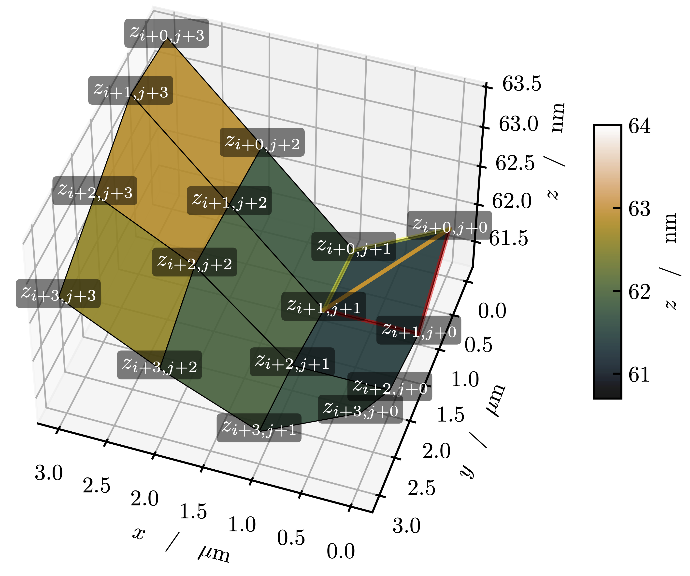

# Surface Enlargement Factor

This Python package provides functionality to read and process surface topography data
(list or matrix format), compute surface areas (triangular mesh), and optionally
remove bending from the data.

## Key Features
- Flexible input (list or matrix)
- Optional unit conversion
- Triangular-mesh surface area / SEF
- Bending correction (row-wise)
- Plotting
- Result writing to text files

## Installation
```bash
pip install .
```

## Usage
Check out `examples/run_example.py` for a simple demonstration.


## Surface Enlargement Factor (mathematical framework)

When surface topographies are recorded using confocal Raman microscopy or atomic force microscopy, the resulting data is arranged on a regular grid. A triangular mesh is then constructed over the grid to approximate the true surface area. The ratio between the calculated (true) surface area and the projected geometric area defines the **Surface Enlargement Factor (SEF)**.

### Coordinate / grid convention used in this package

The topography is represented as a 2D array `z[i,j]` with shape `(N_rows, N_cols)`.

- **x-axis spans the columns** (`j = 0..N_cols-1`)
- **y-axis spans the rows** (`i = 0..N_rows-1`)

We interpret `settings['width'] = Lx` and `settings['height'] = Ly` as the **total physical extents from the first to the last grid point**.
Therefore the grid spacings are:

- $\Delta x = L_x / (N_{cols}-1)$
- $\Delta y = L_y / (N_{rows}-1)$

The **projected area** is:

- $A_{proj} = L_x \cdot L_y$

This makes SEF a pure measure of surface area increase relative to the planar projection.

### Triangular surface area

For each grid cell defined by the four corner points
$(i,j), (i+1,j), (i,j+1), (i+1,j+1)$, two triangles are constructed.

To reduce directional bias, this package computes **both possible diagonals per cell** and averages the resulting cell areas.



For a triangle with vertices A, B, and C, the area is computed via the cross product:

$$
A_{triangle} = \tfrac{1}{2} \lVert (B-A) \times (C-A) \rVert.
$$

The total surface area is the sum over all cell triangles.

Finally, the SEF is defined as:

$$
SEF = \frac{A_{surface}}{A_{proj}}.
$$
